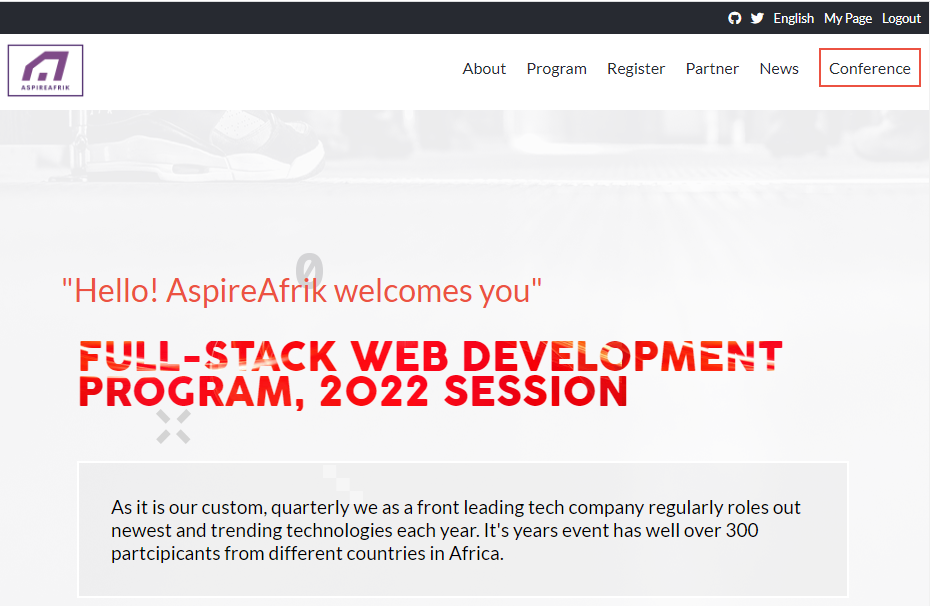
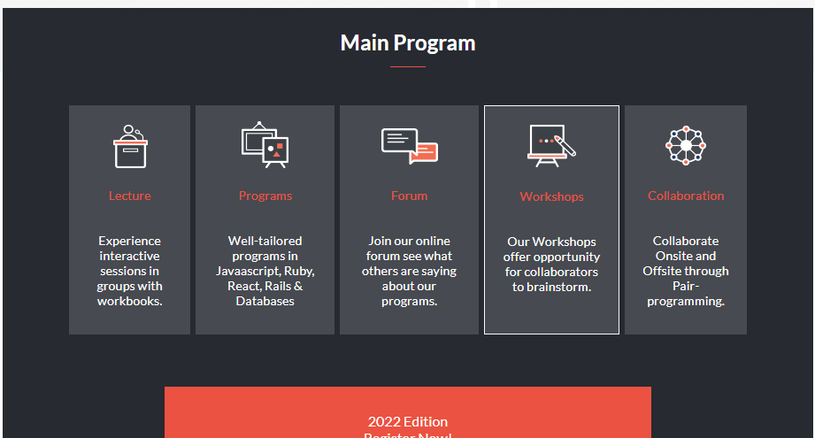
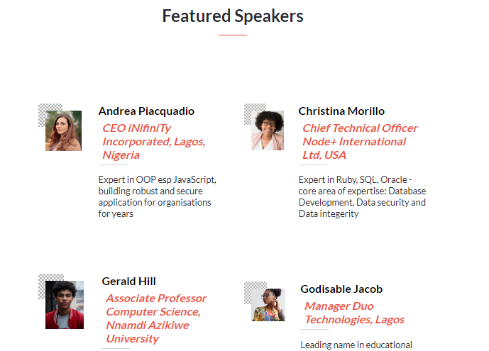
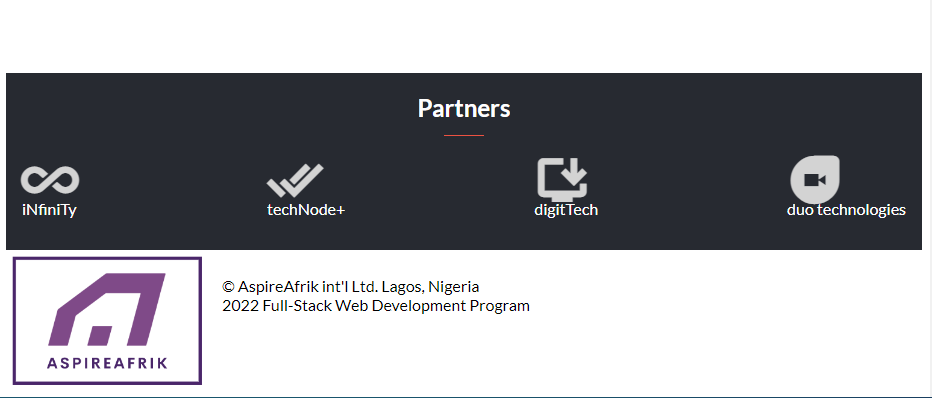
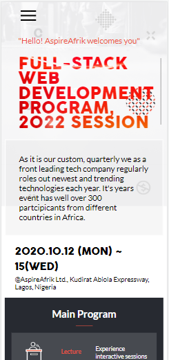
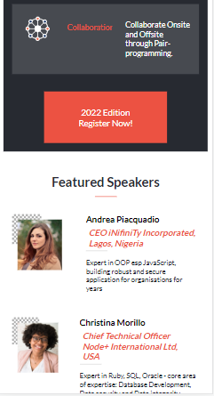

# Capstone: &copy;AspireAfrik WEB DEVELOPMENT PROGRAM, 2022 SESSION

> This project highlights AspireAfrik International Ltd as a leading IT firma in web development and with the latest technologies available in the industry. &copy; AspireAfrik International yearly sources renowed IT technocrats around the world to training up-coming web developers.

## Underneath are attached snapshoots of the web interfaces

 ## Learning objectives

 - Use semantic HTML tags.
 - Apply best practices in HTML code.
 - Use CSS selectors correctly.
 - Use CSS box model.
 - Use Flexbox to place elements in the page.
 - Demonstrate ability to create UIs adaptable to different screen sizes using media queries.
 - Use GitHub Pages to deploy web pages.
 - Apply JavaScript best practices and language style guides in code.
 - Use JavaScript to manipulate DOM elements.
 - Use JavaScript events.
 - Use objects to store and access data.
 - Communicate technical concepts to other technical people.

## Built With

- CSS, HTML, JavaScript

## Live Demo

[Live Demo Link](https://screenrec.com/share/q7ubjVkaAS)

> You can view the project here: 

## Getting Started

### To launch the project locally:

#### Step 1:
- Clone this repository in your local machine terminal:

git clone <code>https://github.co/Okechukwu-muokwugwo/capstone-hmtl-css-js.git</code>

#### Step 2:

- Open the html pages in a web browser preferrably Chrome.

## Authors

👤 Okechukwu Muokwugwo

- GitHub: [@Okechukwu-muokwugwo](https://github.com/Okechukwu-muokwugwo)
- LinkedIn: [LinkedIn](https://www.linkedin.com/in/okei.muokwugwo/)
- Twitter: [@excel4eva](https://twitter.com/excel4eva)

## 🤝 Contributing

Contributions, issues and feature requests are welcome!

## Show your support

Give a ⭐️ if you like this project!

## Acknowledgments

### Design Cindy Shin

- behance: [Cindy Shin](https://www.behance.net/adagio07)
- LinkedIn: [Cindy Shin](https://www.linkedin.com/in/adagio07/)
- dribbble: [Cindy Shin](https://dribbble.com/adagio07/collections)

## 📝 License

This project is [MIT](./MIT.md) licensed.
